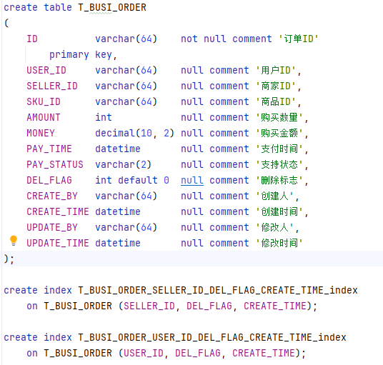
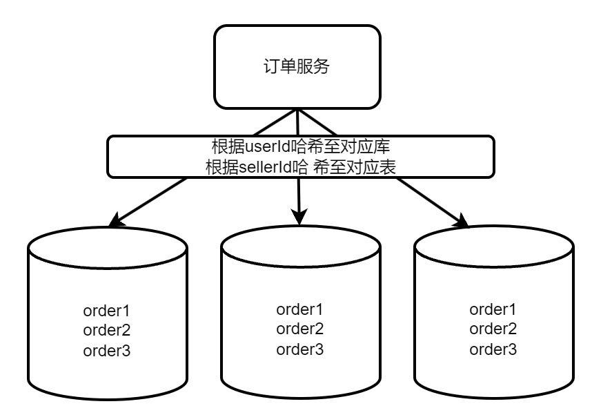
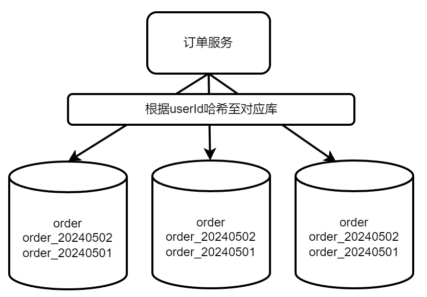
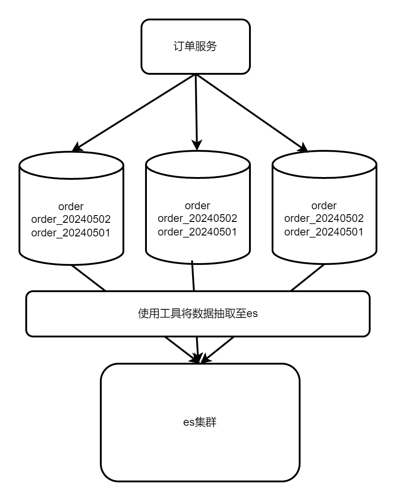
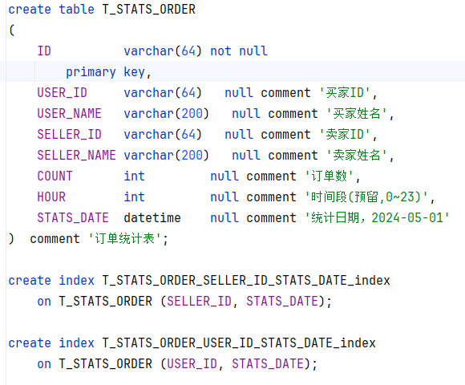

# 分库分表方案

## 表结构

## 方案一

分库键：userId

分表键：sellerId

优点：买家卖家的查询效率都不会太差，数据按买家卖家两个维度进行隔离，便于做维护

缺点：实现业务的方式相对比较复杂，扩展能力较弱

## 方案二

分库键：userId

分表键：createTime

优点：买家相关查询效率高，可持续扩展表，历史订单查询量较小，做冷热库相对便利

缺点：卖家查询效率低，特别是历史数据，需要跨库跨表查询

## 结论

站在长远的角度上看，个人更偏向于方案2

 

## 补充方案

使用es或hbase做实时性较低和历史数据查询

## 索引结构

订单宽表，冗余较常使用字段，以满足常规业务需求

PUT /order/_mapping
{
    "properties": {
        "id": {
            "type": "keyword"
        },
        "userId": {
            "type": "keyword"
        },
        "userName": {
            "type": "text"
        },
        "sellerId": {
            "type": "keyword"
        },
        "sellerName": {
            "type": "text"
        },
        "skuId": {
            "type": "keyword"
        },
        "amount": {
            "type": "keyword"
        },
        "money": {
            "type": "scaled_float",
            "scaling_factor": 100
        },
        "payTime": {
            "type": "keyword"
        },
        "payStatus": {
            "type": "keyword"
        },
        "delFlag": {
            "type": "keyword"
        },
        "createBy": {
            "type": "keyword"
        },
        "createTime": {
            "type": "date"
        },
        "updateBy": {
            "type": "keyword"
        },
        "updateTime": {
            "type": "date"
        }
    }
}

 

# 数据分析

使用中间统计表做数据分析，表结构如下：

按买家ID、卖家ID、统计日期三个维度进行统计。

订单创建成功时触发事件加入队列，业务线程对相应的数据增加订单数。实时性不高可先写入redis，后台按时或按天将数据统计入库。

 

买家排行:

select userName,count from (select max(USER_NAME) userName, sum(COUNT) count from T_STATS_ORDER
             group by USER_ID) stats
order by count desc

卖家排行：

select sellerName,count from (select max(SELLER_NAME) sellerName, sum(COUNT) count from T_STATS_ORDER
             group by SELLER_ID) stats
order by count desc